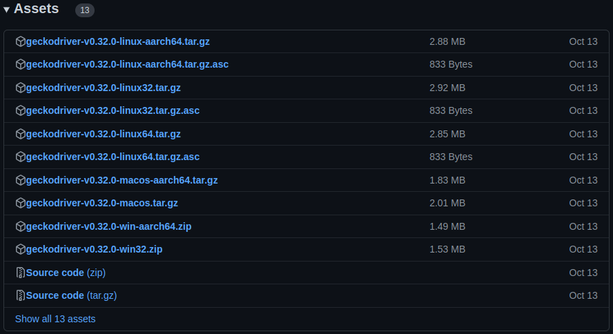

<h1 align="center">
  Web Scrapping da Tabela FIPE
</h1>

<p align="center">
 <a href="#objetivo">Objetivo</a> •
 <a href="#requisitos">Requisitos</a> • 
 <a href="#passo-a-passo">Passo-a-passo</a> • 
 <a href="#autor">Autor</a>
</p>

### Objetivo

Esse projeto visa montar uma base de dados da tabela FIPE. Os veículos que serão pesquisados estão no arquivo vehicles_to_search.json.

### Requisitos

Para rodar esta aplicação, você vai precisar ter instalado em sua máquina as seguintes ferramentas:
[Git](https://git-scm.com), [Python + pip](https://www.python.org/downloads/), [virtualenv](https://virtualenv.pypa.io/en/latest/) e [Firefox](https://www.mozilla.org/pt-BR/firefox/new/).

### Passo-a-passo

```bash
# Clone este repositório
$ git clone https://github.com/GkingOficial/Web-Scrapping

# Acesse a pasta do projeto no terminal/cmd
$ cd Web-Scrapping

# Crie um ambiente virtual para instalar as dependências
$ virtualenv myENV

# Entre no ambiente virtual
$ source myENV/bin/activate

# Instale as dependências
$ pip3 install -r requirements.txt

```

O selenium (que é uma biblioteca que estamos utilizando) trabalha por baixo dos panos com um navegador de internet. Para este projeto, escolhemos o navegador Firefox, por ser mais comum nos computadores. Então, para que o projeto funcione, é necessário que você tenha instalado esse navegador em seu computador.

Após isto, você deve baixar o [Geckodriver (do Firefox)](https://github.com/mozilla/geckodriver/releases) referente ao seu sistema operacional. Como especificado na imagem abaixo:



Extraia o arquivo, e você obterá outro arquivo chamado 'geckodriver'.

Mova o geckodriver para o ambiente virtual myENV que foi criado anteriormente. Especificamente, você deve movê-lo para a pasta /myENV/bin.

### Execução

Antes de tudo, abra o arquivo settings.py e configure as seguintes variáveis:

- computer_id: Representa a identificação de seu computador;
- mini_batch: Representa a quantidade de modelos que serão pesquisados em cada execução da aplicação;
- anos: Define os anos de busca na tabela FIPE;
- meses: Define os meses de busca na tabela FIPE;
- anos_modelo: Define os anos_modelo de busca na Tabela FIPE.

```bash
# Verifique o primeiro indice de busca que seu computador irá buscar
$ python3 Execution1.py

# Execute a aplicação
$ python3 Execution2.py
```

Você pode acompanhar a busca sendo feita pelo terminal da própria execução.

Após o termino da execução, você pode visualizar os dados atualizados no banco de dados através do seguinte comando:

```bash
# Para visualizar os dados atualizados no MongoDB
$ python3 Execution3.py
```

### Autor


[](https://www.instagram.com/daniel_alencar_/) [](https://www.linkedin.com/in/Daniel746/) [](mailto:danielalencar746@gmail.com)


[](https://www.instagram.com/daniel_alencar_/) [](https://www.linkedin.com/in/Daniel746/) [](mailto:danielalencar746@gmail.com)